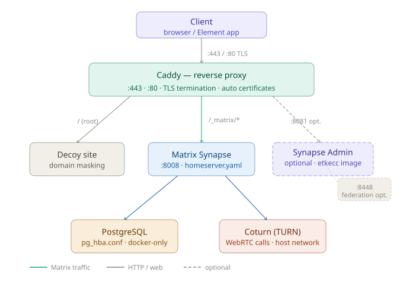
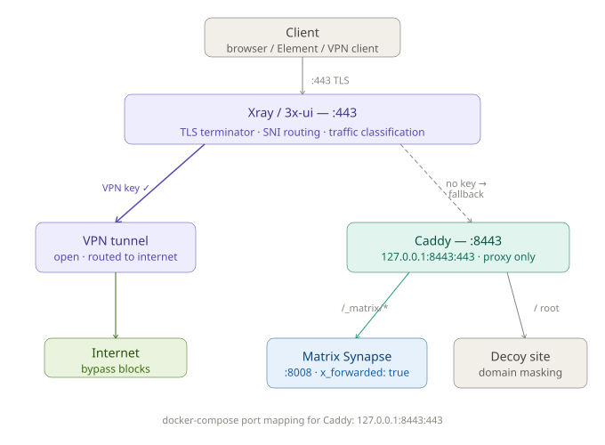
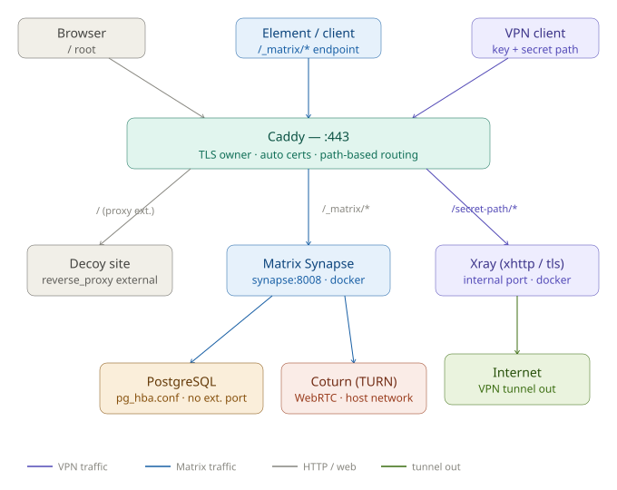

# infra-reference-architecture

Reference deployment architectures for privacy-focused server infrastructure.  
Covers Matrix/Synapse messenger stacks combined with VPN (Xray/WireGuard) — three deployment variants depending on threat model and requirements.

> These are **architecture diagrams**, not step-by-step guides or production configs.  
> The goal is to show how components fit together and why.

---

## Stack overview

| Component | Role |
|---|---|
| **Caddy** | Web server, reverse proxy, automatic TLS (Let's Encrypt) |
| **Matrix Synapse** | Self-hosted messenger server |
| **Element** | Web / mobile Matrix client |
| **Coturn** | TURN server for WebRTC voice/video calls |
| **PostgreSQL** | Primary database for Synapse |
| **Xray / 3x-ui** | VPN frontend, traffic obfuscation (Reality, xhttp) |
| **WireGuard** | VPN tunnel layer |
| **Docker Compose** | Container orchestration for the whole stack |

---

## Deployment variants

### Scheme 1 — Basic (no VPN)

Caddy sits on port 443 and handles everything: TLS termination, routing to Synapse, serving a decoy site for the domain, and optionally exposing an admin panel.

```
Client
  └─► Caddy :443
        ├─► Decoy site       (/)
        ├─► Matrix Synapse   (/_matrix/*)
        └─► Synapse-Admin    (:8081, optional)
              └─► PostgreSQL
              └─► Coturn (TURN/WebRTC)
```

**Use when:** you don't need VPN on the same server, or the VPN runs on a separate host.

Port `8448` (federation) can be closed if open registration from outside is not needed.

---

### Scheme 2 — Xray in front on :443

Xray/3x-ui occupies port 443 and acts as the TLS terminator and frontend proxy. It inspects incoming connections and routes based on whether a valid VPN key is present:

- **VPN key present** → tunnel opened, traffic forwarded to the internet
- **No key** → fallback to Caddy on `127.0.0.1:8443`

```
Client
  └─► Xray :443 (TLS terminator + SNI routing)
        ├─► VPN tunnel        [key present]
        └─► Caddy :8443       [no key → fallback]
              ├─► Matrix Synapse (/_matrix/*)
              └─► Decoy site     (/)
```

**Caddy port mapping in docker-compose:** `127.0.0.1:8443:443`  
**Use when:** you want VPN and messenger on the same IP/domain, with Xray doing traffic classification.

---

### Scheme 3 — Caddy in front, Xray on a subpath

Caddy stays on :443 and handles TLS for everything. Xray runs internally and is exposed only via a specific path (xhttp or WebSocket transport). Caddy routes by path:

```
Client
  ├─► domain /            →  Caddy :443  →  Decoy site (external reverse_proxy)
  ├─► /_matrix/*          →  Caddy :443  →  Matrix Synapse :8008
  └─► /secret-path/*      →  Caddy :443  →  Xray (xhttp/tls) → VPN tunnel → Internet
                                                  └─► PostgreSQL
                                                  └─► Coturn (TURN/WebRTC)
```

**Use when:** you want Caddy to own TLS and certificate management, and route VPN traffic as just another reverse-proxy path. Simpler cert setup; Xray does not need to touch TLS directly.

---

## Security notes

- PostgreSQL is locked to Docker-internal network via `pg_hba.conf` — no external port exposed
- Caddy strips `Server` header and fakes `nginx` to avoid fingerprinting
- Federation port `:8448` should be closed unless you need open registration or server-to-server federation
- Admin panel (`/_synapse-admin`) is protected with `basic_auth` in Caddy and bound only to `127.0.0.1:8081`
- Synapse federation is disabled (`matrix_homeserver_federation_enabled: false`) — whitelist-only model

---

## Diagrams

### Scheme 1 — Basic (no VPN)


### Scheme 2 — Xray in front on :443


### Scheme 3 — Caddy in front, Xray on a subpath


---

## Repository contents

```
/
├── diagrams/
│   ├── scheme-1-basic.svg          # Caddy only, no VPN
│   ├── scheme-2-xray-front.svg     # Xray on :443, Caddy on :8443
│   └── scheme-3-caddy-front.svg    # Caddy on :443, Xray on subpath
└── README.md
```

Config file examples (sanitised) available on request.

---

*Built and maintained as part of independent infrastructure consulting work.*  
*All production secrets have been removed from any configs referenced here.*
